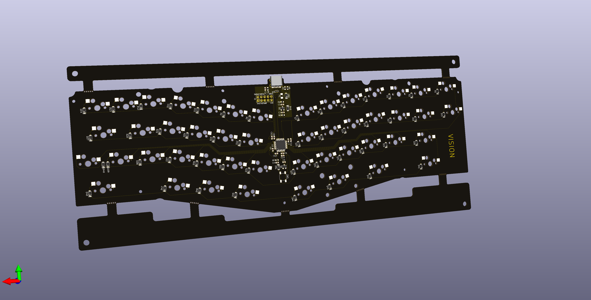

# Vision
PCB for a 40% alice layout keyboard.  
Includes support for STM32, USB-C, and kailh hotswap socket.

## Acknowledgements

I'd like to thank the following people for providing resources for making this PCB. 

- yuktsi for open-sourcing the plate and layout of the [TGR Alice](https://geekhack.org/index.php?topic=95054.0)
- ai03 for his [PCB Designer Guide](https://wiki.ai03.me/books/pcb-design/chapter/pcb-designer-guide), [Voyager40-arm](https://github.com/ai03-2725/Voyager), and [keyboard](https://github.com/ai03-2725/MX_Alps_Hybrid) [related](https://github.com/ai03-2725/Type-C.pretty) [footprints](https://github.com/ai03-2725/random-keyboard-parts.pretty).  
- Gondolindrim for kindly permitting the use of his circuit schematics for STM32 used in his [Acheron project PCBs](http://acheronproject.com/).