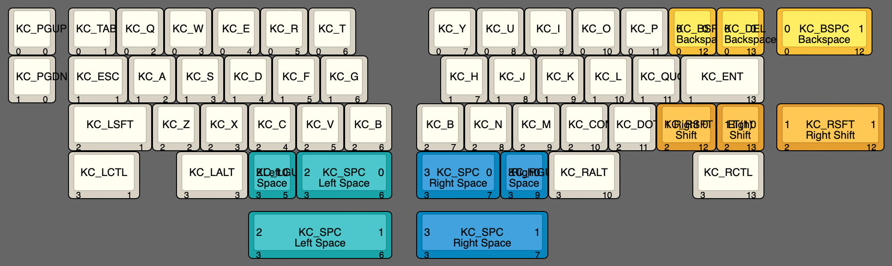

# Vision Alt PCB

A PCB for the [Vision keyboard by SatT Keyboards](https://github.com/satt99/Vision) with alternative layout options.

## Layout

## How to use

Use the gerbers, BOM, and CPL files in the [JLCPCB production files folder](./JLCPCB/production_files/). Set the PCB thickness to 1.2 mm when ordering; otherwise your PCB will not work with the case.

Prototypes pending to check if this works.

The source files were originally in KiCAD 5, converted to KiCAD 6, then modified.
JLC production output was generated with the [JLC Fabrication Toolkit plugin](https://github.com/bennymeg/JLC-Plugin-for-KiCad). 

## Disclaimer

The members of the PCB development team are not liable if you end up with a non-functional PCB. Order at your own risk. Support will not be provided but pull requests will be reviewed and possibly accepted.

## Todo

- [x] Finalize layout changes
- [ ] Order prototypes
- [ ] Write firmware

